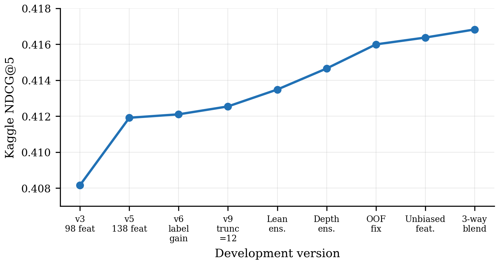
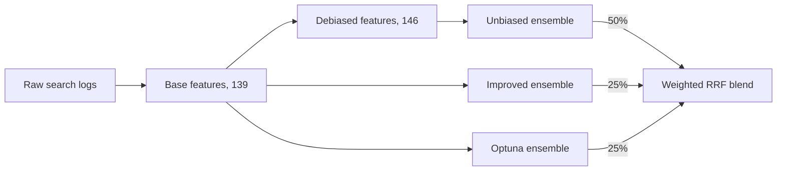
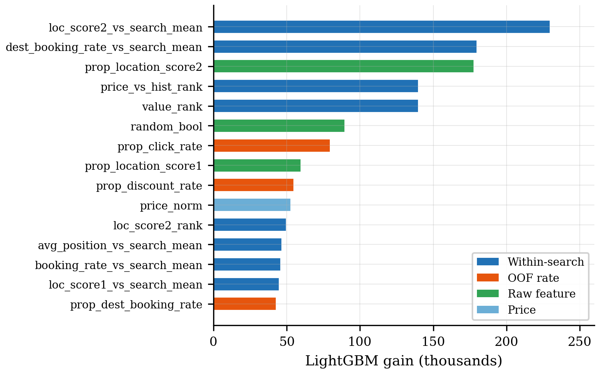
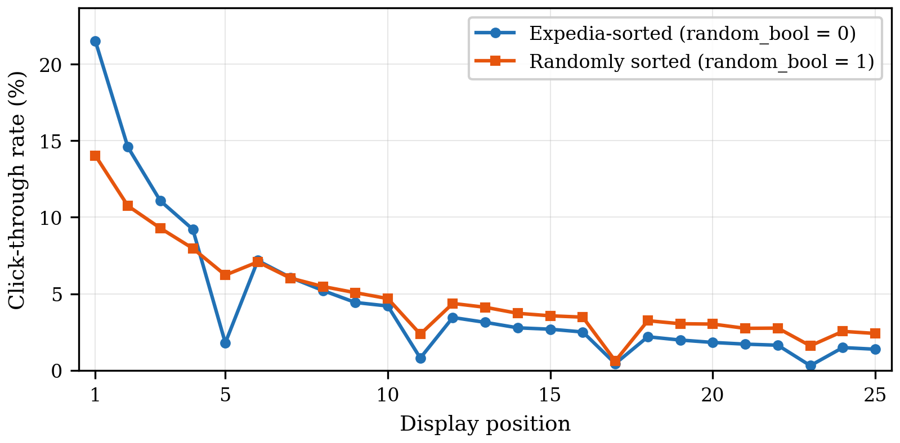

# hotel-rankifornia

Learning to rank for hotel search. LightGBM LambdaMART ensembles trained on Expedia search logs, finishing in the top 10 of a university Kaggle competition with a private leaderboard NDCG@5 of 0.41792.

## The problem

Someone searches Expedia for a hotel and gets back a list of around 25 properties. The goal is to reorder that list so the hotel they end up booking sits at the top, with the ones they click right behind it. Scoring uses NDCG@5 with a relevance of 5 for a booking, 1 for a click and 0 otherwise, so what matters is getting the booked hotel into the first few slots.

The data comes from the [Personalize Expedia Hotel Searches](https://www.kaggle.com/c/expedia-personalized-sort) dataset (ICDM 2013), with about 5 million rows each in train and test. Every row pairs one search with one hotel that was shown, along with price, star rating, review score, location scores, competitor prices and, for training rows, whether the user clicked or booked.

## Results

| Model | Validation NDCG@5 | Public LB | Private LB |
|---|---|---|---|
| Random order | 0.1577 | | |
| Popularity sort, no model | 0.2770 | | |
| KNN collaborative filtering | 0.2689 | | |
| Best single LambdaMART | 0.4017 | | |
| RRF ensemble, 3 models on one feature set | 0.4023 | 0.41637 | |
| **Final blend, 9 models across 3 feature sets** | | **0.41682** | **0.41792** |
| Competition winner | | 0.42640 | 0.42678 |

The private score came out higher than the public one, which suggests the blend was not overfitting the public half of the test set.



## How it works



**Features.** 146 in total. The strongest group compares each hotel to the others in the same search, for example how its location score, price or booking rate sits against the search average. A $150 hotel is cheap in one search and expensive in the next, and the model cares about that difference more than the raw number. The single most useful feature, `loc_score2_vs_search_mean`, is one of these. The rest are target encoded click and booking rates, price and value features, competitor price aggregates, and a few missing value flags.



**Target encoding without leakage.** Historical click and booking rates per hotel are strong features, but they come straight from the labels. Train rows are encoded out of fold with a 5 fold `GroupKFold` on `srch_id`, and the Bayesian smoothing prior is computed inside each fold rather than once on all the data. Test rows use the average of the five fold tables, so their features carry the same amount of noise as the training features. Fixing those two issues was worth +0.0013 on the leaderboard, more than any modelling change.

**Position bias.** Hotels near the top of the list get clicked more whether they are good or not, so raw click rates partly measure where Expedia happened to put a hotel. About 30% of searches were shown in random order (`random_bool = 1`), which gives a clean look at what users actually prefer.



On Expedia sorted lists the first slot gets about 21% of clicks, against 14% under random ordering, and biased and unbiased click rates only correlate at 0.75. The fix computes click and booking rates from the random subset alone, using the same out of fold scheme, and adds bias magnitude features (biased minus unbiased rate) so the model can see how much of a hotel's track record comes from placement. Inverse propensity weighting was tried too, but it dropped validation NDCG@5 from 0.4105 to 0.4035, so the feature based approach stayed.

**Model and validation.** LightGBM with the `lambdarank` objective, which optimises NDCG directly. `srch_id` turned out not to follow time, so validation holds out the latest 20% of searches by timestamp instead of splitting on the id. The validation set only decides the number of boosting rounds, and the final models are retrained on every training search for 1.25 times that number.

**Ensembling.** Within each feature variant a set of candidate models (different depths, learning rates and seeds) is trained, then greedy forward selection keeps adding whichever model improves validation NDCG@5 the most. The chosen models are fused with reciprocal rank fusion (RRF, k = 60). The final submission blends three of these ensembles with weights of 50, 25 and 25 percent.

## Lessons

- **Fixing the data pipeline beat tuning the model.** The two encoding fixes did more for the leaderboard score than every ensemble experiment put together.
- **Validation stopped tracking the leaderboard near the end.** A 60 trial Optuna search improved validation by 0.0016 and the leaderboard by nothing. Late changes only paid off when they brought in genuinely new information.
- **Diversity has to come from the features.** Blends of models trained on the same features had rank correlations above 0.99 and gained nothing. Blending across feature sets (correlation around 0.98) is where the final improvement came from.

The full history of what was tried, including what failed, is in [docs/experiments.md](docs/experiments.md).

## Running it

```bash
python -m venv .venv && source .venv/bin/activate
pip install -r requirements.txt
pip install -e .

# put the training and test CSVs in data/raw/
bash scripts/run_all.sh
```

Or one stage at a time.

```bash
python scripts/build_features.py                       # data/raw to data/processed
python scripts/train_ensemble.py --variant unbiased
python scripts/train_ensemble.py --variant improved
python scripts/train_ensemble.py --variant optuna
python scripts/blend.py                                # outputs/submissions/submission_blend.csv
```

Every script takes `--data-dir`, `--processed-dir` and `--output-dir`. The full candidate search takes a few hours per variant on a laptop. Adding `--reuse-selection` skips the search and retrains only the models and round counts saved in `configs/`, which is much faster. `scripts/tune.py` reruns the Optuna search (around 9 hours for 60 trials, install with `pip install -e ".[tune]"`) and is not needed to reproduce the submission.

The tests run in a few seconds.

```bash
pip install -e ".[dev]"
pytest
```

They cover NDCG@5, the temporal split, RRF and the blend, plus leakage checks for the target encoding and the debiased rates. Those flip the labels inside one fold and check that the fold's own encodings do not move.

## Project layout

```
src/hotel_rankifornia/
    data.py              loading the raw CSVs with compact dtypes
    features.py          base feature engineering
    target_encoding.py   out of fold target encoding
    debiasing.py         position debiased rates
    validation.py        temporal split and NDCG@5
    train.py             LambdaMART training and full data retrain
    ensemble.py          greedy selection and RRF
    blend.py             final cross variant blend
    tuning.py            Optuna search
    pipeline.py          stages used by the scripts
configs/                 hyperparameters, candidates and recorded selections
scripts/                 command line entry points
tests/                   unit tests on small synthetic data
docs/                    experiment log and figures
```

## Known limitations

- Keys that never appear in a training fold fall back to a prior computed on all training labels, which is a small leftover leak for rare hotels.
- Validation NDCG@5 skips searches with no click or booking, and the same validation set drives early stopping, model selection and the blend weights, so it reads optimistic.
- The blend weights were picked with public leaderboard feedback.
- Scores can differ in the last few digits across machines because LightGBM threading and NumPy sorting are not bit identical between platforms. Library versions are pinned in `requirements.txt`.

## Credits

Built with Aniket Dasurkar and Mansi Saxena as a team project in a university data mining course. The dataset belongs to Expedia and is available through the Kaggle competition linked above.
